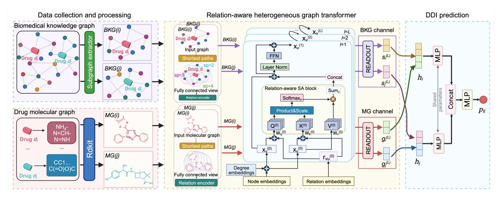
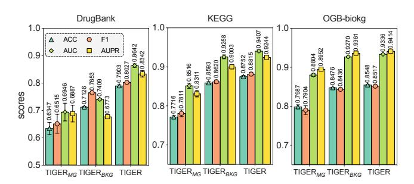
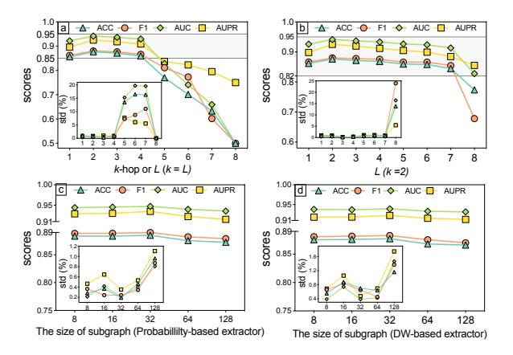
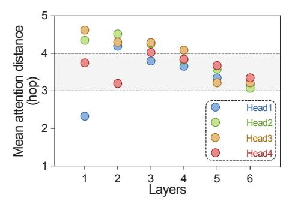
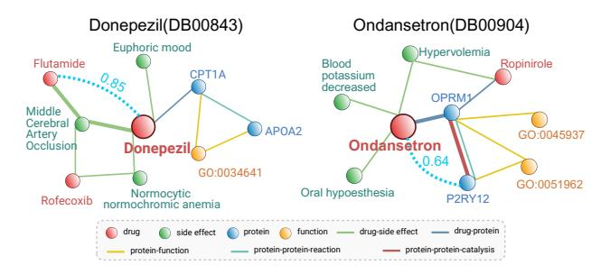
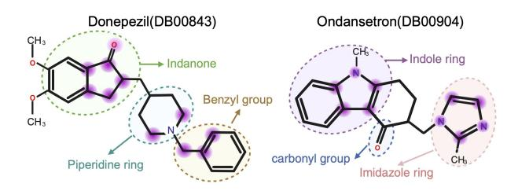

# Dual-Channel Learning Framework for Drug-Drug Interaction Prediction via Relation-Aware Heterogeneous Graph Transformer

Xiaorui Su1,2,3, Pengwei Hu1,2, Zhu-Hong You4, Philip S. Yu3, Lun Hu1,2,\*

1 Xinjiang Technical Institutes of Physics and Chemistry, Urumqi, China
 2 University of Chinese Academy of Sciences, Beijing, China
 3 University of Illinois Chicago, Chicago, USA

4 Guangxi Key Lab of Human-machine Interaction and Intelligent Decision, Nanning, China suxiaorui19@mails.ucas.ac.cn, zhuhongyou@gxas.cn, psyu@uic.edu, {hpw, hulun}@ms.xjb.ac.cn

#### **Abstract**

Identifying novel drug-drug interactions (DDIs) is a crucial task in pharmacology, as the interference between pharmacological substances can pose serious medical risks. In recent years, several network-based techniques have emerged for predicting DDIs. However, they primarily focus on local structures within DDI-related networks, often overlooking the significance of indirect connections between pairwise drug nodes from a global perspective. Additionally, effectively handling heterogeneous information present in both biomedical knowledge graphs and drug molecular graphs remains a challenge for improved performance of DDI prediction. To address these limitations, we propose a Transformerbased relatIon-aware Graph rEpresentation leaRning framework (TIGER) for DDI prediction. TIGER leverages the Transformer architecture to effectively exploit the structure of heterogeneous graph, which allows it direct learning of long dependencies and high-order structures. Furthermore, TIGER incorporates a relation-aware self-attention mechanism, capturing a diverse range of semantic relations that exist between pairs of nodes in heterogeneous graph. In addition to these advancements, TIGER enhances predictive accuracy by modeling DDI prediction task using a dual-channel network, where drug molecular graph and biomedical knowledge graph are fed into two respective channels. By incorporating embeddings obtained at graph and node levels, TIGER can benefit from structural properties of drugs as well as rich contextual information provided by biomedical knowledge graph. Extensive experiments conducted on three real-world datasets demonstrate the effectiveness of TIGER in DDI prediction. Furthermore, case studies highlight its ability to provide a deeper understanding of underlying mechanisms of DDIs.

### Introduction

Drug-drug interactions (DDIs) refer to the biological effects of concomitantly administered drugs, which can modify the pharmacological effects of the drug, thereby leading to adverse drug reactions (ADRs) (Vilar et al. 2014). Studies (Finkel, Clark, and Cubeddu 2009) have shown that when 2-5 drugs are combined, the incidence of adverse reactions is 18.6%. When more than 5 drugs are taken together, the incidence of adverse reactions is 81.4%. Such situations may

\*Corresponding author.

Copyright © 2024, Association for the Advancement of Artificial Intelligence (www.aaai.org). All rights reserved.

cause injuries or deaths to patients. Therefore, the identification of potential DDIs is of great significance for alleviating impacts of such emergencies, thus guiding drug development and benefiting public health.

In recent years, a significant line of research has been explored for identifying potential DDIs from graph-structured data, including homogeneous graphs and heterogeneous graphs (Zhao et al. 2023). Compared to homogeneous graphs composed solely of drug entities, heterogeneous graphs excel in abstracting and modeling complex systems, thereby generating greater interest. In the field of DDI predictions, two kinds of heterogeneous graphs are commonly used. One is biomedical knowledge graph, where each node represents a molecule, such as drug or protein, and edge is the relation between them. The other is drug molecular graph, where each node denotes an atom, and each edge is a bond

In view of the success of graph neural networks (GNNs) (Kipf and Welling 2017), there are several attempts to adopt GNNs to learn with heterogeneous graphs. In the case of biomedical knowledge graphs, a relation-specific transformation is designed to encode semantic relationships between entities. Subsequently, a message-passing framework can be employed to propagate and aggregate information throughout the graph, enabling the learning of drug node-level representations. On the other hand, a common paradigm involves assigning a [VNode] (virtual node) to each atom or utilizing a pooling function to aggregate information from individual atoms. This allows for the creation of a drug graph-level representation that captures the overall structure of the drug molecule.

Indeed, GNN-based methods have demonstrated impressive performance in the DDI prediction task, significantly advancing the analysis of biomedical knowledge graphs and drug molecular graphs. However, they do have certain limitations (Chen, O'Bray, and Borgwardt 2022). The major limitation is that they learn drug representations solely by aggregating information from local neighbors. As a result, they might encounter challenges in effectively capturing complex graph structures and long-range dependencies. This limitation could impede their ability to fully comprehend the intricate relationships inherent in biomedical knowledge graphs and drug molecular graphs. In addition, these methods also suffer from the issue of over-squashing. The over-

squashing leads to information loss and distortion during iterative message-passing, thereby affecting model performances. It is thus essential to design a new architecture beyond local neighborhood aggregation.

To address the mentioned issues, the Transformer architecture (Vaswani et al. 2017) is considered a promising solution due to its ability to directly model distant nodes and capture dependencies across the entire graph. Consequently, there is active research into extending the Transformer architecture to graph-based tasks, such as DDI prediction. An example of this is Graphormer (Ying et al. 2021), a recent Transformer-based model tailored for molecular graph-level representation learning. Graphormer enhances the Transformer architecture to handle graph-structured data effectively. This is achieved through the inclusion of graph positional encoding and attention mechanisms that consider both node and edge features. As a result, the model not only evaluates individual node attributes but also grasps the global topological information.

Though Graphormer is effective in graph-level representation learning tasks, its property, which takes the entire graph as input, limits its scalability and applicability to large-scale graphs, such as biomedical knowledge graphs. On the other hand, biomedical knowledge graph is rich in semantic information and the node pair in it may have various relationships. For example, a drug may interact with a protein through different mechanisms or may exhibit various side effects depending on the context. However, most of the existing Transformer architecture-based approaches lack the ability to differentiate the signifcance of multiple relationships between a pair of nodes.

To address above issues, we propose a novel Transformerbased relatIon-aware Graph rEpresentation leaRning framework, TIGER for brevity, to model DDI predictions at both graph and node levels. TIGER handles the node-level representation learning tasks with sampled subgraphs centred on drug nodes, rather than the whole graph. TIGER also implements its encoder by a relation-aware self-attention mechanism for processing multiple relationships between a node pair, rather than self-attention mechanism. With these two designs, TIGER is capable of learning both graph-level and node-level representations. Then the drug representation is obtained by fusing representations from different levels. Finally, TIGER makes DDI predictions with obtained drug representations. The main contributions of this work are summarized as follows:

- We model the DDI data using a novel dual-channel heterogeneous graph approach. Our approach aims to more effectively uncover potential DDIs by considering the diverse aspects of drug characteristics and their relationships within the biomedical domain.
- We introduce a relation-aware self-attention mechanism designed to capture and leverage the diverse and multiple semantic relationships present in the graph data.
- We conduct extensive experiments on three datasets to demonstrate the effectiveness of TIGER in both predicting DDIs and understanding of the underlying mechanisms of drug interactions.

## Related Work

Molecular Graph-based Method. Drug molecular graphs play a crucial role in providing a structural representation of drugs, enabling a better understanding of their chemical composition and potential interactions with other molecules (Vilar et al. 2014). Deep learning approaches, such as graph convolutional networks (GCN), graph attention networks (GAT), have been employed to predict DDIs based on drug molecular graphs (Guo et al. 2022; Nyamabo et al. 2021). These methods effectively capture local and global interactions between atoms within a molecule. Furthermore, recent advancements include the application of Graphormer (Zhang et al. 2022), a Transformer-based method for graph-level representation learning, in DDI predictions. Notably, this approach differentiates itself from GNNs by directly modeling distant nodes within the graph.

Biomedical Knowledge Graph-based Method. These methods (Celebi et al. 2019; Karim et al. 2019) leverage the rich information available in biomedical knowledge graphs to enhance the prediction score. KGNN (Lin et al. 2020) pioneers to incorporate GCN to encode the structured relationships in knowledge graphs. It learns comprehensive representations for drugs by propagating information across the graph, taking into account the relationships between entities. Considering multi-relational DDIs, another GNN-based method, KG2ECapsule (Su et al. 2023), is proposed. It utilizes capsule networks to conduct non-linear transformations, enriching the representations of entities within a specifc relational space. In addition, DDKG (Su et al. 2022) utilizes GAT in knowledge graph-based DDI predictions. The attention mechanism in it is employed to uncover the importance of various triplets, enabling the model to focus on critical drug-relation-drug relationships within the graph.

Multi-level-based Method. These methods acquire drug representations at both graph and node levels. The graphlevel representation is obtained from drug molecular graphs, while the node-level representation is learned from drugrelated interaction graphs. Most of these methods are conducted on homogeneous networks, such as DDI networks. The Bi-GNN (Bai et al. 2020) employs a bi-level graph structure to predict DDIs using GAT. At the highest level, there is a drug interaction graph. Each biological entity within this graph is then expanded to its molecular graph. Another multi-view-based method, MIRACLE (Wang et al. 2021), employs GCN to encode DDI relationships and a bond-aware attentive message propagating to predict DDIs. While MDNN (Lyu et al. 2021) is designed to detect DDIs with heterogeneous networks, it introduces two pathways to effectively model both the topological information of the knowledge graph and the features of the drugs.

## Method

The architecture of TIGER is depicted in Fig. 1. TIGER learns the drug representations by taking into account both biomedical knowledge graph and drug molecular graphs, and then identifes potential DDIs in an end-to-end way.

Figure 1: The framework of proposed TIGER.

#### **Relation-aware Self-Attention**

The self-attention mechanism is a foundational component of the Transformer architecture. However, it is inherently position-aware and overlooks the nature of the distinct types of relationship between node pairs. Besides, we have noted: (i) distant nodes often lack explicit relations, and (ii) a node pair can have multiple relationships. To address these, we introduce the notion of relation-aware self-attention by employing following strategies:

- To incorporate distant nodes, we establish relationships between them based on the distance of their shortest path.
- To address the presence of multiple relationships, we consider each relation as a distinct edge.

Given an arbitrary graph in G=(V,E,R), where the node attribute for node  $v\in V$  is denoted by  $x_v\in\mathbb{R}^d$  and the node attributes for all nodes are stored in  $\boldsymbol{X}\in\mathbb{R}^{|V|\times d}$ . For any node pair (v,u) with  $C\geq 1$  types of relations, we define their attention logits based on both node features and their relationships as shown below:

$$\psi(x_{v}, x_{u}, r_{v \Leftrightarrow u}^{c}) = (x_{v} + r_{v \to u}) \boldsymbol{W}_{q}^{T} \boldsymbol{W}_{k} (x_{u} + r_{u \to v})$$

$$= x_{v} \boldsymbol{W}_{q}^{T} \boldsymbol{W}_{k} x_{u} (I) + x_{v} \boldsymbol{W}_{q}^{T} \boldsymbol{W}_{k} r_{u \to v} (II)$$

$$+ r_{v \to u} \boldsymbol{W}_{q}^{T} \boldsymbol{W}_{k} x_{u} (III)$$

$$+ r_{v \to u} \boldsymbol{W}_{q}^{T} \boldsymbol{W}_{k} r_{u \to v} (IV)$$

$$(1)$$

where  $r_{v \Leftrightarrow u}^c$  denotes the c-th relation between (v, u) and  $r_{v \to u} = r_{u \to v}$  when the graph G is an indirected graph.  $W_q, W_k \in \mathbb{R}^{d_k \times d}$  are trainable matrices to generate query Q and key K representations.

The new defined  $\psi(\cdot,\cdot,\cdot)$  allows the model to consider both source-specific (II) and target-specific (III) relationships when attending to different positions (I). It also helps the model capture common patterns or dependencies that are present across the entire input by the universal relation bias (IV). It should be noted, when dealing with pairs of distant

nodes, the function  $\psi(\cdot,\cdot,\cdot)$  is also capable of capturing their structural information as the relationship between them is initialized based on the distance of their shortest path. By introducing relationships, we define our relation-aware self-attention as:

$$RAttn(x_v) = \sum_{u \in V} \frac{\sum_{c \in C} f(x_v, x_u, r_{v \Leftrightarrow u}^c)}{\sum_{w \in V} \sum_{c \in C} f(x_v, x_w, r_{v \Leftrightarrow w}^c)} \phi(x_u)$$
(2)

where  $f(\cdot, \cdot, \cdot) = \exp(\psi(\cdot, \cdot, \cdot)/\sqrt{d_k})$  and  $\phi(x_u) = \mathbf{W}_v x_u$ .  $\mathbf{W}_v \in \mathbb{R}^{d_v \times d}$  is trainable to generate value  $\mathbf{V}$ .

### **Relation-aware Heterogeneous Graph Transformer**

After defining our relation-aware self-attention function, the remaining components of the relation-aware heterogeneous graph transformer follow the same architecture as the Transformer, depicted in Fig. 1. To enrich the graph structural information, we also incorporate the position embedding specified by node degree to each node feature as following:

$$x_v^{(0)} = x_v + z_{deg(v)}, \forall v \in V$$
 (3)

where  $x_v^{(0)}$  is the input to the relation-aware self-attention block, deg(v) denotes the degree of node v, and  $z(\cdot)$  is an embedding layer specified by node degree.

After a relation-aware self-attention block, its output  $\operatorname{RAttn}(x_v^{(0)})$  is passed through a skip connection and a two layer feed-forward neural network (FFN) to generate updated representations  $x_v^{(1)}$ . This process is defined by:

$$\hat{\boldsymbol{X}^{(l)}} = \boldsymbol{X}^{(l-1)} + \operatorname{RAttn}(\boldsymbol{X}^{(l-1)}) \tag{4}$$

$$\boldsymbol{X}^{(l)} = \text{FFN}(\hat{\boldsymbol{X}^{(l)}}) := \text{ReLU}(\hat{\boldsymbol{X}^{(l)}}\boldsymbol{W}_1^{(l)})\boldsymbol{W}_2^{(l)}$$
 (5)

where  $\boldsymbol{X}^{(l)}$  is the updated representation and  $\boldsymbol{W}_1^{(l)}$  and  $\boldsymbol{W}_2^{(l)}$  are trainable parameters in the FNN of l-th ( $1 \leq l \leq L$ ) layer of TIGER.

#### **Dual-channel Representation Learning**

After the introduction of the main block of TIGER, we present the proposed novel dual-channel representation combining drug graph-level representation learning in molecular graph (MG) and drug node-level representation learning in biomedical knowledge graph (BKG).

**Molecular Graph Channel** Given the molecular graph MG(i) = (A, B, T) of drug  $d_i$ , where A is the set of atoms, B is the set of bonds, and T is the set of relations. The drug graph-level representation  $g_i \in \mathbb{R}^d$  is the summarization over the  $X^{(L)}$  via a READOUT(·) function:

$$g_i = \text{READOUT}(\{x_a^{(L)}\}_{a=1}^{|A|})$$
 (6)

The READOUT function can be any permutation-invariant function. Specifically, we apply a simple averaging strategy as the READOUT function throughout the paper.

**Biomedical Knowledge Graph Channel** As previously mentioned in the introduction, biomedical knowledge graphs are typically much larger than molecular graphs and the Transformer architecture is also constrained by long inputs. To apply the TIGER for learning node-level representations in BKG, we first extract the subgraph BKG(i) for each drug  $d_i$  contained in BKG. Three alternative subgraph extraction methods are provided and explored in this work:

- **k-subtree-based Extractor**: The subgraph for each node is constructed by including the node itself and its connected nodes within *k* levels. Moreover, within the subtree, each node, excluding the leaf nodes, possesses a constant number of child nodes.
- **DeepWalk-based Extractor**: The subgraph for each node is formed by utilizing fixed-length random walk sequences initiated from that specific node.
- Probability-based Extractor: The subgraph is generated by selecting a fixed-size set of nodes with the probabilities defined in pagerank matrix (Page et al. 1998).

The sampled subgraph BKG(i) is then fed into the relation-aware graph transformer module. The drug nodelevel representation  $s_i$  is defined as  $s_i = \mathbf{X}^{(L)}[idx]$ , where idx denotes the index of drug  $d_i$  in BKG(i).

**Drug Dual-channel Representation** Once the drug graph-level representation and node-level representation have been obtained after L upper layers of the relation-aware graph transformer, they are concatenated and passed through the multi-layer perceptron (MLP) to obtain the drug dual-channel representation  $h_i \in \mathbb{R}^d$  as follows:

$$h_i = \mathrm{MLP}(g_i^{(L)}||s_i^{(L)}) \tag{7}$$

where  $g_i^{(L)}$  and  $s_i^{(L)}$  denote the output of L-th relation-aware graph transformer block.

#### **Drug-Drug Interaction Prediction**

The DDI prediction task in our study can be defined as a link prediction problem based on BKG and  $MG := \{MG(i)\}_{i=1}^{|D|}$ , where D is the drug set of BKG. Considering a drug pair

 $(d_i,d_j)$ , where  $d_i,d_j \in BKG$ , and their molecular graphs MG(i) and MG(j), we can derive their dual-channel representations  $h_i$  and  $h_j$ . Then they are concatenated and fed into MLP to predict a link prediction score:

$$p_{ij} = \text{MLP}(h_i||h_j) \tag{8}$$

Formally, we formulate the cross entropy loss  $\mathcal{L}_{label}$  for all DDI pairs:

$$\mathcal{L}_{label} = -\sum_{(i,j)\in Y} y_{ij} \log(p_{ij}) + (1 - y_{ij}) \log(1 - p_{ij})$$
 (9)

where Y denotes the drug pair set and  $y_{ij}$  is the ground-truth value.

To ensure the acquisition of a discriminative drug dual-channel representation, we employ the Jensen-Shannon (JS) mutual information (MI) estimator (Nowozin, Cseke, and Tomioka 2016) on drug dual-channel representation  $h_i$ . This is done to maximize the estimated MI over the given drug molecular graph  $g_i$  and extracted drug subgraph  $s_{BKG(i)} = \text{READOUT}(\{x_v^{(L)}\}_{v=1}^{|BKG(i)|})$ , respectively. By introducing the discriminator  $\mathcal{D}: \mathbb{R}^d \times \mathbb{R}^d \to \mathbb{R}$ , the MI enhancement loss function  $\mathcal{L}_{MI}^{hg}$  between  $h_i$  and  $g_i$  can be formulated as a binary cross-entropy loss:

$$\mathcal{L}_{MI}^{hg} = \frac{1}{n + n_{neg}} \left( \sum_{i \in D}^{n} \log(\mathcal{D}(h_i, g_i) + \sum_{k \in D}^{n_{neg}} \log(\mathcal{D}(h_i, \tilde{g_k}))) \right)$$
(10)

where  $n_{neg}$  denotes the number of negative samples and the negative samples are generated in a batch-wise fashion. The  $\mathcal{L}_{MI}^{hs}$  is formulated in the same way as shown in  $\mathcal{L}_{MI}^{hg}$ .

With the supervised classification loss  $\mathcal{L}_{label}$  and self-supervised MI loss  $\mathcal{L}_{MI}$ , we train TIGER with following objective function:

$$\mathcal{L} = \mathcal{L}_{label} + \beta_1 \mathcal{L}_{MI}^{hg} + \beta_2 \mathcal{L}_{MI}^{hs} \tag{11}$$

where  $\beta_1$  and  $\beta_2$  are hyper-parameters for the trade-off for different loss components.

### **Experiment**

In this section, we first describe the datasets, comparison methods, and evaluation metrics used in the experiment. Then, we compare the performances of TIGER with other comparative methods. Finally, we make detailed analysis of TIGER under different experimental settings.

#### **Datasets and Settings**

**Datasets.** We evaluate the TIGER on three benchmark drug-related heterogeneous graph datasets, i.e., DrugBank (Wishart et al. 2018), KEGG (Kanehisa et al. 2017), and OGB-biokg (Hu et al. 2020), with different scales for verifying the scalability and robustness of TIGER.

• **DrugBank**: We parse the verified DDIs of provided profile from DrugBank, compile an edge list of drug identifier combinations, and finally obtain 10,404 approved DDIs span 1,052 drugs;

|            | DrugBank  | KEGG    | OGB-biokg |
|------------|-----------|---------|-----------|
| #Drugs     | 1,052     | 786     | 808       |
| #DDIs      | 10,404    | 13,787  | 111,520   |
| #Nodes     | 391,116   | 129,910 | 93,773    |
| #Relations | 71        | 167     | 13        |
| #Links     | 1,587,305 | 362,870 | 3,892,462 |

Table 1: The statistic of three heterogeneous networks.

- KEGG: We parse the sources from KEGG and map them to DrugBank identifers, which results in 786 approved drugs and 13,787 approved DDIs;
- OGB-biokg: We download it from OGB website, and fnally obtain 111,520 DDIs span 808 approved drugs.

Moreover, for the drug nodes in above datasets, we also collect their drug SMILES strings, respectively. After that, we convert drug SMILES strings into molecular 2D graphs by rdkit (Landrum et al. 2013). It should be noted that we remove the data items that cannot be converted into graphs from SMILES strings, and their related interactions in heterogeneous graphs in our preprocessing. Meanwhile, the heterogeneous network should not contain any explicit information about DDIs. Hence, we also remove all DDIs from the original datasets, respectively. The statistics of three datasets are shown in Table 1.

Baselines. TIGER is against a variety of baselines which can be categorized as follows:

- Molecular Graph-based: We select two representative methods, SSI-DDI (Nyamabo et al. 2021) and Molormer (Zhang et al. 2022), as baselines. They aim to predict DDIs by utilizing graph-level representations learned from drug molecular graphs.
- Biomedical Knowledge Graph-based: Three representative methods are listed as baselines, including KGNN (Lin et al. 2020), KG2ECapsule (Su et al. 2023), and DDKG (Su et al. 2022). They employ drug node-level representations learned from the biomedical knowledge graph to model DDI predictions.
- Multi-level-based: We select three related work as baselines, involving Bi-GNN (Bai et al. 2020), MIRACLE (Wang et al. 2021), and MDNN (Lyu et al. 2021). Specifically, Bi-GNN and MIRACLE are constructed based on homogeneous networks, while MDNN is designed for heterogeneous networks.

Evaluation Metrics To evaluate the effectiveness of TIGER and all baselines, we employ four metrics for evaluation, including ACC, F1 score, AUC, and AUPR.

Experimental Settings. We perform fve-fold crossvalidation to train TIGER and the aforementioned baselines on three datasets. Negative samples are randomly selected from the complement set of positive samples, ensuring an equal number of positive samples in all datasets.

TIGER is implemented using Pytorch v1.10.2 and trained on NVIDIA A100 GPU. We use the Adam optimizer for model training. The training process is conducted for 50 epochs, and all trainable parameters are optimized by Adam algorithm with a learning rate of 0.001. We set the d = 64, β1 = β2 = 0.1, L = 2 for all extractors. For k-subtreebased extractors, k is set to 2 and the constant number of child nodes is set to 4. The size of subgraph for probability and DeepWalk-based extractors is set to 32. For all baselines, they are retrained on the same machine with the same hyper-parameter settings reported in their original work.

### Main Results

Table 2 reports all performances on three datasets. The number in bold denotes the best results of all methods and that in *bold* denotes the best result of baselines. Based on the results presented in Table 2, it can be observed that TIGER outperforms the other eight baseline methods in DDI predictions across all three datasets. When compared with the best baseline method on each dataset, there is an average improvement of 3.66% in ACC, 4.17% in F1 score, 3.78% in AUC, and 4.83% in AUPR. This demonstrates its effectiveness in predicting DDIs. Among the three datasets, we fnd that TIGER is particular effective in handling sparse networks, as it has the most signifcant performance improvement on the DrugBank dataset. The observed improvement suggests that TIGER has the capability to capture more valuable structural information, such as long dependencies, which can be credited to its utilization of the Transformer architecture. It is worth highlighting that TIGER demonstrates remarkable performances on the other two datasets as well. Despite the OGB-biokg dataset being extremely dense, TIGER achieves an impressive improvement by surpassing an ACC of 0.90 on it. This observation suggests that TIGER can effectively distinguish and leverage useful information even in challenging scenarios characterized by dense data. Therefore, the consistent superiority of TIGER across multiple datasets further reinforces its potential as a robust and reliable approach for DDI predictions.

### Ablation Study

Effects of Subgraph Extractors. The results displayed in Table 2 shows: (i) the probability-based extractor tends to be compatible with low-density datasets; (ii) the DeepWalkbased extractor shows better suitability for dense datasets; (iii) the k-subtree-based extractor demonstrates robustness and versatility in extracting subgraphs from various types of networks, but it may experience a loss in accuracy compared to other extractors.

Effects of Dual-Channels. We further investigate whether the *MG*(·) and *BKG*(·) bring the complementary information to TIGER. The presented Fig. 2 shows that *BKG*(·) has a more pronounced positive impact on DDI prediction tasks compared to *MG*(·). It also indicates that incorporating both *MG*(·) and *BKG*(·) together contributes the most to accurate DDI predictions.

### Hyper-Parameter Studies

Effect of k/L. We frst explore the effect of k in the ksubtree extractor by changing it from 1 to 8. In the initial setting, we set k equal to the number of model layers L. As

| Method      | DrugBank |         |         | KEGG    |         |         | OGB-biokg |         |         |         |         |         |
|-------------|----------|---------|---------|---------|---------|---------|-----------|---------|---------|---------|---------|---------|
|             | ACC      | F1      | AUC     | AUPR    | ACC     | F1      | AUC       | AUPR    | ACC     | F1      | AUC     | AUPR    |
| SSI-DDI     | 0.6847   | 0.6830  | 0.7510  | 0.7316  | 0.7722  | 0.7795  | 0.8506    | 0.8293  | 0.7849  | 0.7878  | 0.8695  | 0.8837  |
|             | (±0.71)  | (±1.77) | (±1.12) | (±1.32) | (±1.42) | (±1.18) | (±1.47)   | (±1.71) | (±0.87) | (±0.57) | (±0.57) | (±0.53) |
| Molormer    | 0.5763   | 0.5941  | 0.6086  | 0.5990  | 0.6371  | 0.6608  | 0.6916    | 0.6760  | 0.7357  | 0.7251  | 0.8091  | 0.8169  |
|             | (±1.12)  | (±1.13) | (±1.05) | (±0.87) | (±2.72) | (±1.54) | (±3.69)   | (±3.88) | (±1.59) | (±2.02) | (±1.83) | (±2.01) |
| KGNN        | 0.6681   | 0.6784  | 0.7219  | 0.6614  | 0.7802  | 0.7815  | 0.8536    | 0.8185  | 0.8253  | 0.8189  | 0.9059  | 0.9184  |
|             | (±0.56)  | (±1.96) | (±0.56) | (±0.71) | (±0.95) | (±1.14) | (±0.54)   | (±0.79) | (±0.19) | (±2.67) | (±0.09) | (±0.06) |
| KG2ECapsule | 0.6628   | 0.6694  | 0.7131  | 0.6557  | 0.8227  | 0.8278  | 0.8960    | 0.8699  | 0.8282  | 0.8230  | 0.9087  | 0.9203  |
|             | (±0.47)  | (±0.42) | (±0.63) | (±0.92) | (±0.55) | (±0.49) | (±0.44)   | (±0.69) | (±0.16) | (±0.20) | (±0.10) | (±0.07) |
| DDKG        | 0.7035   | 0.7089  | 0.7638  | 0.7292  | 0.8305  | 0.8355  | 0.9000    | 0.8690  | 0.8048  | 0.7957  | 0.8821  | 0.8961  |
|             | (±1.04)  | (±2.53) | (±0.32) | (±0.50) | (±0.83) | (±0.85) | (±0.75)   | (±1.18) | (±0.97) | (±0.98) | (±0.58) | (±0.48) |
| Bi-GNN      | 0.7165   | 0.7419  | 0.7672  | 0.7054  | 0.8503  | 0.8580  | 0.9147    | 0.8840  | 0.8510  | 0.8472  | 0.9298  | 0.9361  |
|             | (±2.18)  | (±0.25) | (±4.11) | (±4.41) | (±0.60) | (±0.58) | (±0.63)   | (±0.93) | (±0.22) | (±0.27) | (±0.18) | (±0.16) |
| MIRACLE     | 0.6636   | 0.6630  | 0.7102  | 0.6698  | 0.8379  | 0.8421  | 0.9090    | 0.8801  | 0.8923  | 0.8930  | 0.9495  | 0.9526  |
|             | (±0.58)  | (±0.41) | (±0.74) | (±0.86) | (±0.42) | (±0.81) | (±0.25)   | (±0.53) | (±0.20) | (±0.14) | (±0.07) | (±0.11) |
| MDNN        | 0.7394   | 0.7313  | 0.8052  | 0.7653  | 0.8410  | 0.8459  | 0.9099    | 0.8821  | 0.8578  | 0.8547  | 0.9351  | 0.9423  |
|             | (±0.21)  | (±0.43) | (±0.36) | (±0.98) | (±0.42) | (±0.28) | (±0.41)   | (±0.56) | (±0.16) | (±0.29) | (±0.17) | (±0.17) |
| TIGER-KS    | 0.7903   | 0.8027  | 0.8642  | 0.8342  | 0.8752  | 0.8815  | 0.9407    | 0.9244  | 0.8548  | 0.8517  | 0.9336  | 0.9414  |
|             | (±0.36)  | (±0.44) | (±0.65) | (±1.15) | (±0.32) | (±0.24) | (±0.30)   | (±0.40) | (±0.09) | (±0.25) | (±0.15) | (±0.18) |
| TIGER-DW    | 0.7849   | 0.7977  | 0.8572  | 0.8261  | 0.8781  | 0.8848  | 0.9414    | 0.9238  | 0.9162  | 0.9143  | 0.9693  | 0.9748  |
|             | (±0.38)  | (±0.41) | (±0.31) | (±0.33) | (±0.45) | (±0.44) | (±0.26)   | (±0.34) | (±0.09) | (±0.12) | (±0.07) | (±0.10) |
| TIGER-P     | 0.7905   | 0.8033  | 0.8662  | 0.8370  | 0.8850  | 0.8899  | 0.9473    | 0.9350  | 0.8791  | 0.8754  | 0.9477  | 0.9571  |
|             | (±0.87)  | (±0.94) | (±0.57) | (±0.68) | (±0.19) | (±0.24) | (±0.21)   | (±0.35) | (±0.16) | (±0.17) | (±0.14) | (±0.12) |
| Improv. (%) | 5.11     | 7.20    | 6.10    | 7.17    | 3.47    | 3.19    | 3.26      | 5.10    | 2.39    | 2.13    | 1.98    | 2.22    |

Table 2: The performances with TIGER and baseline methods on three datasets, reported as the average value and standard deviation (%) across fve folds.

Figure 2: The performances with TIGER and other two variants on three datasets, where TIGER*MG* and TIGER*BKG* solely considers *MG* and *BKG*, respectively.

shown in Fig. 3a, when k is set to 2, TIGER shows the best performance on all indicators. As k increases beyond 4, the performance of TIGER starts to degrade and becomes unstable. This may be due to the signifcant increase in the noise contained in subgraph, since the size of the subgraph grows exponentially as k increases. However, it is noteworthy that TIGER does not experience over-ftting as L increases to 7 when k is fxed, as shown in Fig. 3b. This observation highlights the robustness of TIGER as its performance is not adversely affected by the increase of L.

Effect of Subgraph Size. Fig. 3c and Fig. 3d show that TIGER achieves the optimal and stable performance when the subgraph size is set to 32. It is worth highlighting that even though the performance of TIGER starts to decline beyond the optimal size, it still manages to achieve AUC and

Figure 3: The results of TIGER with varying values of k, L, and |BKG(i)|.

AUPR values above 0.90. These two observations suggest: (i) selecting a subgraph with the size of 32 provides the suffcient contextual and topological information; (ii) TIGER possesses the capability to capture and leverage key structural patterns and dependencies, regardless of the specifc size of the subgraph being considered.

### Case Study

To gain insights into the reasons behind the strong performance of TIGER in DDI prediction tasks, we frst aims to uncover how connections within the network structure con-

Figure 4: Attention distance by head and network depth on the KEGG dataset. Each dot show mean attention distance in hops across graphs of a head at a layer.

Figure 5: The subgraphs centered on Donepezil and Ondansetron, which are extracted by probability-based extractors.

tribute to the performance of TIGER. We compute the attention distance (Dosovitskiy et al. 2021) across heads and network depth by averaging pairwise distances on subgraphs weighted by attention scores. Fig. 4 shows that heads attend globally over the subgraphs in the lowest layers and they tend to be local in deeper layers. It also highlights that highorder structures play a significant role in DDI predictions, as node with 3-hop receive higher attention weights. These observations suggest that TIGER is able to leverage global dependencies and uncover valuable patterns that contribute to its superior performance.

We next demonstrate its explanatory effectiveness using a specific example (Donepezil, Ondansetron). Fig. 5 effectively highlights connections and nodes influencing the representations of target drugs and their interaction patterns in the network. In Fig. 5, it is evident that the use of Ondansetron has been linked to decreased blood potassium levels. This reduction can subsequently elevate blood pressure levels, increasing the risk of blood clot formation and middle cerebral artery occlusion in certain circumstances. Consequently, combining Donepezil and Ondansetron may have potential adverse effects on the central nervous system. This observation based on TIGER align with the existing knowledge surrounding the medications involved (Wilde and Markham 1996; Shigeta and Homma 2001). TIGER also exhibits its ability to discern between multiple relations, as it identifies the catalytic role of OPRM1 and P2RY12 as being

Figure 6: The molecular graphs of Donepezil and Ondansetron.

more significant in determining the importance of P2RY12. All of these observations suggest that TIGER is capable of providing valuable insights into drug interactions.

We also visualize the molecular graphs of Donepezil and Ondansetron in Fig. 6 and label the important components based on the attention weights obtained from TIGER. TIGER accurately recognizes the critical constituents within both molecules. The benzyl group (-CH2C6H5) attached to the piperidine ring and the indanone group enable Donepezil to function as an acetylcholinesterase inhibitor, preventing the breakdown of acetylcholine. TIGER also pinpoints the significance of the imidazole ring and the indole ring linked with a carbonyl group, which allow it to act as a selective serotonin 5-HT3 receptor antagonist, blocking serotonin signaling in specific areas of the central nervous system (Brittain 2002). As both medications affect the central nervous system (CNS), combining them may enhance their CNSrelated side effects. This observation highlights that TIGER can provide deeper insights into molecular structures.

#### Conclusion

This paper presents TIGER, a novel dual-channel relation-aware graph transformer model designed for predicting DDIs. TIGER utilizes the combined representation learning from drug molecular graphs and biomedical knowledge graphs to predict DDIs. It effectively captures long dependencies and high-order structures, which are vital for accurate DDI predictions. Moreover, TIGER demonstrates exceptional proficiency in handling multiple relations within the graph. By providing valuable insights into DDI predictions, TIGER enhances our understanding of the complex biological system underlying drug interactions.

#### Acknowledgments

This work was supported in part by the Natural Science Foundation of Xinjiang Uygur Autonomous Region under grant 2021D01D05, in part by the National Natural Science Foundation of China under grant 62373348, in part by the Xinjiang Tianchi Talents Program under grant E33B9401, in part by CAS Light of the West Multidisciplinary Team project under grant xbzg-zdsys-202114, in part by Pioneer Hundred Talents Program of Chinese Academy of Sciences, in part by the National Science Fund for Distinguished Young Scholars of China under grant 62325308, and NSF under grant III-2106758.

## References

- Bai, Y.; Gu, K.; Sun, Y.; and Wang, W. 2020. Bi-level graph neural networks for drug-drug interaction prediction. *arXiv preprint arXiv:2006.14002*.
- Brittain, H. G. 2002. Profles of drug substances, excipients, and related methodology. *Analy Profles Drug Subst Excipients*, 29: 1–5.
- Celebi, R.; Uyar, H.; Yasar, E.; Gumus, O.; Dikenelli, O.; and Dumontier, M. 2019. Evaluation of knowledge graph embedding approaches for drug-drug interaction prediction in realistic settings. *BMC bioinformatics*, 20(1): 1–14.
- Chen, D.; O'Bray, L.; and Borgwardt, K. 2022. Structureaware transformer for graph representation learning. In *International Conference on Machine Learning*, 3469–3489. PMLR.
- Dosovitskiy, A.; Beyer, L.; Kolesnikov, A.; Weissenborn, D.; Zhai, X.; Unterthiner, T.; Dehghani, M.; Minderer, M.; Heigold, G.; Gelly, S.; Uszkoreit, J.; and Houlsby, N. 2021. An Image is Worth 16x16 Words: Transformers for Image Recognition at Scale. In *International Conference on Learning Representations*.
- Finkel, R.; Clark, M. A.; and Cubeddu, L. X. 2009. *Pharmacology*. Lippincott Williams & Wilkins.
- Guo, Z.; Nan, B.; Tian, Y.; Wiest, O.; Zhang, C.; and Chawla, N. V. 2022. Graph-based molecular representation learning. *arXiv preprint arXiv:2207.04869*.
- Hu, W.; Fey, M.; Zitnik, M.; Dong, Y.; Ren, H.; Liu, B.; Catasta, M.; and Leskovec, J. 2020. Open graph benchmark: Datasets for machine learning on graphs. *Advances in neural information processing systems*, 33: 22118–22133.
- Kanehisa, M.; Furumichi, M.; Tanabe, M.; Sato, Y.; and Morishima, K. 2017. KEGG: new perspectives on genomes, pathways, diseases and drugs. *Nucleic acids research*, 45(D1): D353–D361.
- Karim, M. R.; Cochez, M.; Jares, J. B.; Uddin, M.; Beyan, O.; and Decker, S. 2019. Drug-drug interaction prediction based on knowledge graph embeddings and convolutional-LSTM network. In *Proceedings of the 10th ACM international conference on bioinformatics, computational biology and health informatics*, 113–123.
- Kipf, T. N.; and Welling, M. 2017. Semi-Supervised Classifcation with Graph Convolutional Networks. In *International Conference on Learning Representations*.
- Landrum, G.; et al. 2013. RDKit: A software suite for cheminformatics, computational chemistry, and predictive modeling. *Greg Landrum*, 8: 31.
- Lin, X.; Quan, Z.; Wang, Z.-J.; Ma, T.; and Zeng, X. 2020. KGNN: Knowledge Graph Neural Network for Drug-Drug Interaction Prediction. In *IJCAI*, volume 380, 2739–2745.
- Lyu, T.; Gao, J.; Tian, L.; Li, Z.; Zhang, P.; and Zhang, J. 2021. MDNN: A Multimodal Deep Neural Network for Predicting Drug-Drug Interaction Events. In *IJCAI*, 3536–3542.
- Nowozin, S.; Cseke, B.; and Tomioka, R. 2016. f-gan: Training generative neural samplers using variational divergence minimization. *Advances in neural information processing systems*, 29.

- Nyamabo; K, A.; Yu, H.; and Shi, J.-Y. 2021. SSI– DDI: substructure–substructure interactions for drug–drug interaction prediction. *Briefngs in Bioinformatics*, 22(6): bbab133.
- Page, L.; Brin, S.; Motwani, R.; and Winograd, T. 1998. The pagerank citation ranking: Bring order to the web. Technical report, Technical report, stanford University.
- Shigeta, M.; and Homma, A. 2001. Donepezil for Alzheimer's disease: pharmacodynamic, pharmacokinetic, and clinical profles. *CNS Drug Reviews*, 7(4): 353–368.
- Su, X.; Hu, L.; You, Z.; Hu, P.; and Zhao, B. 2022. Attention-based knowledge graph representation learning for predicting drug-drug interactions. *Briefngs in bioinformatics*, 23(3): bbac140.
- Su, X.; You, Z.; Huang, D.; Wang, L.; Wong, L.; Ji, B.; and Zhao, B. 2023. Biomedical Knowledge Graph Embedding With Capsule Network for Multi-Label Drug-Drug Interaction Prediction. *IEEE Transactions on Knowledge and Data Engineering*, 35(6): 5640–5651.
- Vaswani, A.; Shazeer, N.; Parmar, N.; Uszkoreit, J.; Jones, L.; Gomez, A. N.; Kaiser, Ł.; and Polosukhin, I. 2017. Attention is all you need. *Advances in neural information processing systems*, 30.
- Vilar, S.; Uriarte, E.; Santana, L.; Lorberbaum, T.; Hripcsak, G.; Friedman, C.; and Tatonetti, N. P. 2014. Similarity-based modeling in large-scale prediction of drug-drug interactions. *Nature protocols*, 9(9): 2147–2163.
- Wang, Y.; Min, Y.; Chen, X.; and Wu, J. 2021. Multi-View Graph Contrastive Representation Learning for Drug-Drug Interaction Prediction. In *Proceedings of the Web Conference 2021*, WWW '21, 2921–2933. New York, NY, USA: Association for Computing Machinery. ISBN 9781450383127.
- Wilde, M. I.; and Markham, A. 1996. Ondansetron: a review of its pharmacology and preliminary clinical fndings in novel applications. *Drugs*, 52: 773–794.
- Wishart, D. S.; Feunang, Y. D.; Guo, A. C.; Lo, E. J.; Marcu, A.; Grant, J. R.; Sajed, T.; Johnson, D.; Li, C.; Sayeeda, Z.; et al. 2018. DrugBank 5.0: a major update to the DrugBank database for 2018. *Nucleic acids research*, 46(D1): D1074– D1082.
- Ying, C.; Cai, T.; Luo, S.; Zheng, S.; Ke, G.; He, D.; Shen, Y.; and Liu, T.-Y. 2021. Do transformers really perform badly for graph representation? *Advances in Neural Information Processing Systems*, 34: 28877–28888.
- Zhang, X.; Wang, G.; Meng, X.; Wang, S.; Zhang, Y.; Rodriguez-Paton, A.; Wang, J.; and Wang, X. 2022. Molormer: a lightweight self-attention-based method focused on spatial structure of molecular graph for drug–drug interactions prediction. *Briefngs in Bioinformatics*, 23(5).
- Zhao, B.-W.; Su, X.-R.; Hu, P.-W.; Huang, Y.-A.; You, Z.- H.; and Hu, L. 2023. iGRLDTI: an improved graph representation learning method for predicting drug–target interactions over heterogeneous biological information network. *Bioinformatics*, 39(8): btad451.